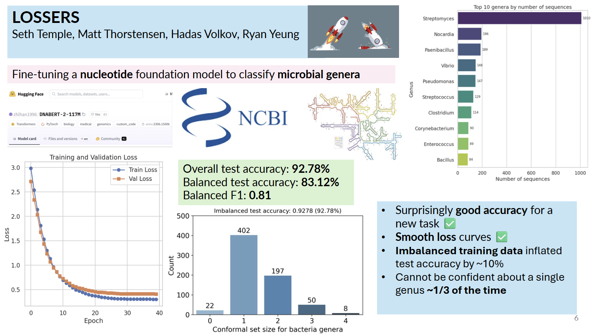

# lossers

	

## 🚀 Foundation Models for Science — Hackathon Project
### 📅 Workshop at the University of Toronto | November 3–5, 2025

🧬 Fine-tuned DNA-BERT with LoRA on NCBI 16S rRNA sequences for genus classification, paired with conformal prediction for calibrated uncertainty (83% balanced accuracy, 0.80 macro F1).

### 🧪 Project overview

We downloaded 16S rRNA sequences from NCBI and fine-tuned DNA-BERT with LoRA to classify sequences by genus. We pair the classifier with conformal prediction to produce calibrated prediction sets and quantify uncertainty.

### 🎯 Aims

- Apply conformal prediction to DNA sequence classifiers to quantify uncertainty.
- Evaluate coverage, set sizes, and calibration on validation/test splits.
- Experiment with fine-tuning foundation models for genomics and assess UQ impact.

📝 License: see `LICENSE`.

### 📊 Results

- Balanced accuracy: 83%
- Macro F1: 0.80

	

